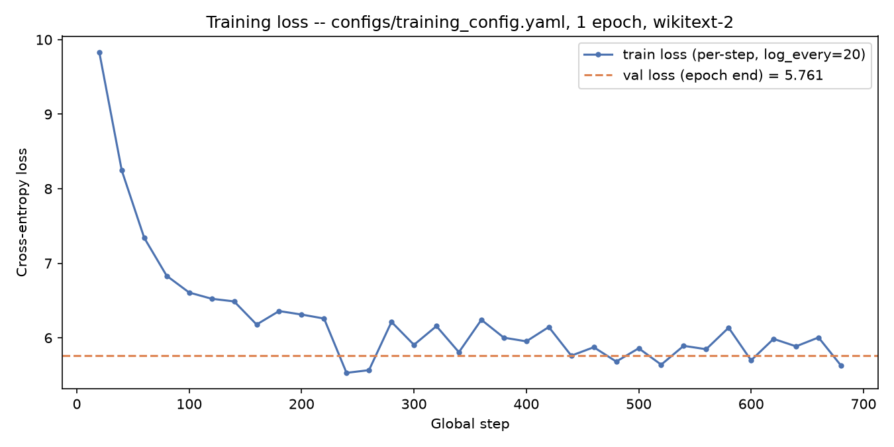
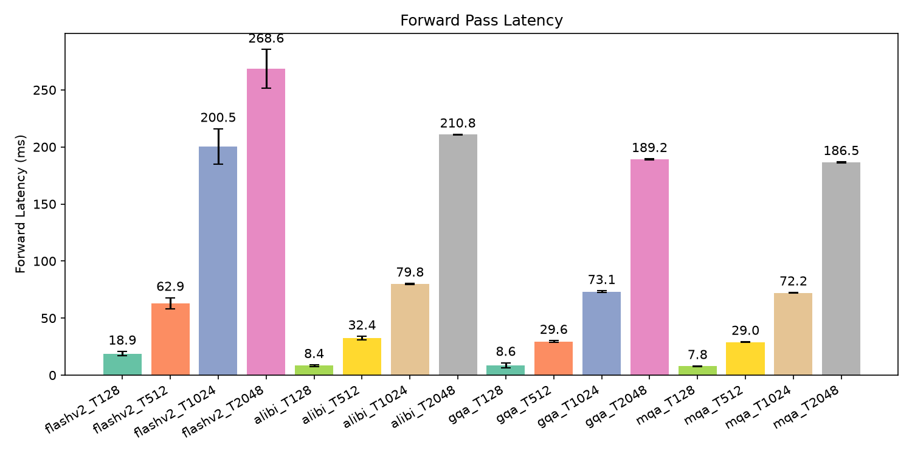
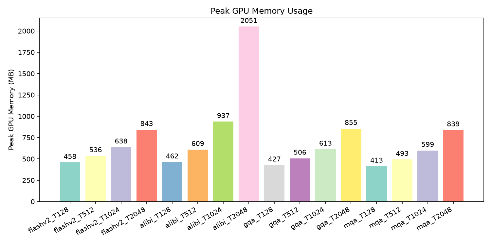
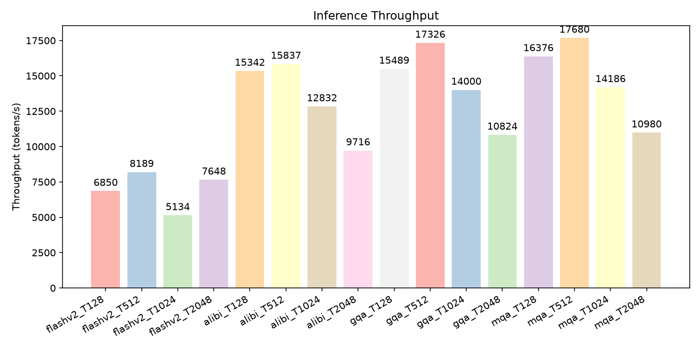

# Efficient Transformer Toolkit

**Optimized Attention Mechanisms for Long-Context Language Models**

A from-scratch PyTorch toolkit for building, training, benchmarking, and
deploying transformer models with a focus on attention-layer efficiency.
It implements six attention variants (vanilla MHA, FlashAttention v1/v2,
ALiBi, GQA, MQA, block-sparse), three positional encoding schemes (RoPE,
sinusoidal, learned), a full training loop, benchmarking/visualization
tooling, and an inference engine with KV-caching and post-training
quantization.

## Features

- **Attention variants** (`src/attention/`) — `MultiHeadAttention`,
  `FlashAttentionV1`/`FlashAttentionV2` (tiled online-softmax), `Alibi`,
  `GroupedQueryAttention` (GQA), `MultiQueryAttention` (MQA), and
  `BlockSparseAttention` (local + global + strided).
- **Positional encodings** (`src/position/`) — Rotary (RoPE, GPT-NeoX
  "rotate_half" style), sinusoidal, and learned embeddings.
- **Configurable models** (`src/models/transformer.py`) — a single
  `Transformer` class that builds encoder-only (BERT-like), decoder-only
  (GPT-like), or encoder-decoder (T5-like) models from one
  `TransformerConfig`.
- **Training** (`src/training/`) — `Trainer` with AMP, gradient
  accumulation/clipping, cosine/linear/constant LR schedules, checkpointing,
  and early stopping.
- **Inference** (`src/inference/`) — KV-cached autoregressive generation,
  post-training **quantization**, and TorchScript/ONNX export.
- **Benchmarking & visualization** (`src/benchmark/`, `src/visualization/`)
  — latency/memory/throughput comparisons across attention types and
  sequence lengths, plus attention-map and training-curve plots.

## Installation

This project uses [uv](https://docs.astral.sh/uv/) as its primary package
manager (see `pyproject.toml` / `uv.lock`):

```bash
uv sync
```

Alternatively, with plain pip:

```bash
pip install -r requirements.txt
# or, for CUDA torch specifically:
pip install torch --index-url https://download.pytorch.org/whl/cu126
```

Requires Python 3.14+ (see `pyproject.toml`).

## Quick Start

```python
from src.models.transformer import Transformer, TransformerConfig

config = TransformerConfig(
    vocab_size=50257,
    d_model=768,
    n_heads=12,
    n_layers=6,
    attn_type="flashv2",     # "flashv1" | "flashv2" | "alibi" | "gqa" | "mqa"
    pos_encoding="rope",     # "rope" | "sinusoidal" | "learned"
    causal=True,
)
model = Transformer(config, use_encoder=False, use_decoder=True)  # GPT-like
```

## Training

```bash
python scripts/run_train.py --config configs/default_config.yaml

# or override individual fields:
python scripts/run_train.py \
    --config experiments/exp_002_flash/config.yaml \
    --num_epochs 20 --lr 1e-4
```

See `configs/README.md` for the full config-key reference and
`experiments/` for ready-made experiment configs (baseline MHA, FlashAttention,
GQA).

## Evaluation & Benchmarking

```bash
python scripts/run_eval.py --checkpoint outputs/checkpoints/final.pt --data_path datasets/wikitext-2/wiki.test.tokens

python scripts/run_benchmark.py --attention_types flashv2 alibi gqa mqa --seq_lengths 128 512 1024 2048
```

## Results

The figures and numbers below are from actually running this toolkit's own
scripts end-to-end on an RTX 3050 Laptop GPU (4GB VRAM) — not hand-written.
Reproduce them yourself with the commands shown in each subsection; a fresh
run regenerates everything under `outputs/`, which is gitignored (see
[Outputs & Reproducibility](#outputs--reproducibility) below).

### Training

```bash
python scripts/run_train.py --config configs/training_config.yaml \
    --num_epochs 1 --eval_every 1 --log_every 20 \
    --output_dir outputs/checkpoints/demo
```

A 15.5M-param decoder-only model (`configs/training_config.yaml`: `d_model=256`,
`n_heads=4`, `n_layers=2`, FlashAttention v2 + RoPE), trained for 1 epoch
(692 steps) on wikitext-2:

| Metric | Value |
|---|---|
| Train loss (start → end) | 9.86 → ~5.6 |
| Val loss | 5.761 |
| Val perplexity | 317.8 |



### Attention benchmarks

```bash
python scripts/run_benchmark.py \
    --attention_types flashv2 alibi gqa mqa \
    --seq_lengths 128 512 1024 2048 --n_kv_heads 4
```

A 109M-param (MHA-equivalent) decoder-only model, `d_model=768`, `n_heads=12`,
`n_layers=6`, forward-pass only (no KV-cache), 10 timed runs + 3 warmup per
config. GQA/MQA use 4 and 1 KV heads respectively, hence their lower
parameter counts and memory:

| seq_len | flashv2 | alibi | gqa (4 kv heads) | mqa |
|---|---|---|---|---|
| params | 109.4M | 109.4M | **100.0M** | **96.4M** |
| 128 latency (ms) | 18.9 | 8.4 | 8.6 | 7.8 |
| 2048 latency (ms) | 268.6 | 210.8 | 189.2 | 186.5 |
| 2048 peak memory (MB) | 843 | 2051 | 855 | 839 |
| 2048 throughput (tok/s) | 7648 | 9716 | 10824 | 10980 |

(Latency at very short sequences is dominated by Python/kernel-launch
overhead and varies run-to-run more than the longer-sequence numbers do;
the 2048 column is the more stable comparison.)





Notable, honestly-reported result: this repo's `FlashAttentionV1`/`V2` are
**didactic, pure-PyTorch block-tiled reference implementations** of the
online-softmax algorithm (Python-level loops over Q/K/V blocks) — not the
fused CUDA kernel from the `flash-attn` package. They demonstrate the
algorithm correctly (see `src/attention/flash.py`) but are *slower* here than
the plain-matmul ALiBi/GQA/MQA paths, whose single batched matmul beats
per-block Python-loop overhead at these sizes on this GPU. ALiBi shows the
highest memory footprint at long sequences because it materializes a full
`[heads, seq, seq]` bias tensor. GQA/MQA's real win — shown above — is fewer
KV-projection parameters and lower memory, matching their design intent.

### Quantization (real numbers)

```bash
python -m scripts.run_quantize --checkpoint outputs/checkpoints/demo/final.pt \
    --method dynamic --vocab_size 50257 --d_model 256 --n_heads 4 --n_layers 2 \
    --attn_type flashv2 --pos_encoding rope --output outputs/quantized/demo_int8.pt
```

Applied to the 15.5M-param checkpoint trained above:

| | Before | After (`int8` dynamic) |
|---|---|---|
| `nn.Parameter` count | 15,490,816 | 12,869,376 |
| Reported param memory | 59.09 MB | 49.09 MB |

The ~2.6M "removed" parameters are the attention/FFN `nn.Linear` weights,
converted to packed `int8` tensors that PyTorch no longer counts as
`nn.Parameter`s (the accounting artifact, not the compression, hence
"reported"). `nn.Embedding` isn't touched by dynamic quantization, and at
this scale the token embedding table (`50257 × 256`, ~51MB) dominates total
model size — so on a small demo model like this one, don't expect the
*on-disk checkpoint* to shrink dramatically; the win is much larger on models
with big `d_model`/FFN dimensions relative to vocab size, which is the
realistic target for this feature.

## Quantization

`src/inference/quantization.py` provides three post-training strategies for
shrinking a trained model and speeding up inference. All of them take a
`Transformer` (or any `nn.Module`) and return a modified module — nothing
here changes training code, it's an inference-time step you apply *after*
loading a trained checkpoint. Quantization is applied **after** training,
not during it: train a normal full-precision checkpoint first, then quantize
that checkpoint.

### CLI: train, then quantize

```bash
# 1. Train a checkpoint (writes outputs/checkpoints/final.pt, best.pt, ...)
python scripts/run_train.py --config configs/default_config.yaml

# 2. Quantize the trained checkpoint with scripts/run_quantize.py
python -m scripts.run_quantize \
    --checkpoint outputs/checkpoints/final.pt \
    --method dynamic \
    --output outputs/quantized/model_int8.pt

# Match the checkpoint's architecture if it differs from the defaults
# (same flags as run_train.py's model group: --d_model, --n_heads, --n_layers,
# --attn_type, --pos_encoding, --vocab_size, --model_type). If run_train.py
# wrote a config.json next to the checkpoint, it's picked up automatically
# via --config_json (or auto-detected in the checkpoint's directory).
```

`scripts/run_quantize.py` loads the checkpoint, applies the chosen method,
runs a sanity forward pass, and saves the result as a single `.pt` bundle
(`{"model": ..., "config": ..., "quantization_method": ...}`) — see
`python -m scripts.run_quantize --help` for every flag. One command per
method:

```bash
# Dynamic int8 (no calibration data needed; CPU, or CUDA via bitsandbytes
# automatically if it's installed and --device cuda is passed)
python -m scripts.run_quantize --checkpoint outputs/checkpoints/final.pt \
    --method dynamic --output outputs/quantized/model_int8.pt

# Static int8 with calibration data (best accuracy/size trade-off, CPU only)
python -m scripts.run_quantize --checkpoint outputs/checkpoints/final.pt \
    --method static --calibration_data datasets/wikitext-2/wiki.valid.tokens \
    --output outputs/quantized/model_static.pt

# FP16 (GPU Tensor Cores, no quantization artifacts)
python -m scripts.run_quantize --checkpoint outputs/checkpoints/final.pt \
    --method fp16 --device cuda --output outputs/quantized/model_fp16.pt
```

Load the saved bundle back and generate with it (optionally with the
KV-cache from `InferenceEngine`, for plain MHA/FlashAttention models):

```python
import torch
from src.inference.engine import InferenceEngine

bundle = torch.load("outputs/quantized/model_int8.pt", weights_only=False)
model = bundle["model"]

engine = InferenceEngine(model, device="cpu", use_kv_cache=False)
output_ids = engine.generate(input_ids, max_new_tokens=100, do_sample=True, top_k=40)
```

### 1. Dynamic quantization — `quantize_dynamic()`

The simplest option: no calibration data needed. Weights of `nn.Linear`
(and RNN) layers are quantized to `int8` ahead of time; activations are
quantized on-the-fly per forward pass. Best default choice for CPU inference.

```python
import torch
from src.models.transformer import Transformer
from src.inference.quantization import quantize_dynamic

model = Transformer.from_pretrained("outputs/checkpoints/final")
model.eval()

quantized = quantize_dynamic(model, dtype=torch.qint8)
# quantized.lm_head, quantized.encoder/.decoder Linear layers are now int8
```

Pass `exclude=["lm_head"]` to skip specific submodules by name prefix (e.g.
to keep the output projection in full precision for numerical stability).

If [`bitsandbytes`](https://github.com/bitsandbytes-foundation/bitsandbytes)
is installed **and** the model is already on a CUDA device, `quantize_dynamic`
automatically routes to 8-bit `bnb.nn.Linear8bitLt` layers instead (better
throughput on GPU than PyTorch's CPU-only `qint8` path):

```python
model = model.cuda()
quantized = quantize_dynamic(model)  # uses bitsandbytes Int8 automatically
```

### 2. Static quantization — `quantize_static()`

Higher accuracy than dynamic quantization because both weights *and*
activations are quantized ahead of time, using ranges estimated from a
calibration pass over real (or representative) data. CPU only
(`fbgemm` backend); the model is moved to CPU for the conversion and
returned on its original device.

Only `nn.Linear` layers are quantized (each wrapped individually with
`torch.quantization.QuantWrapper`, so its input is quantized right before
the matmul and dequantized right after); embeddings, LayerNorm, and
attention math stay `float32`. This is what makes eager-mode static
quantization work at all on an architecture like this one — quantizing
the *whole* model would require inserting `QuantStub`/`DeQuantStub` at
the model's actual input/output boundary, which this toolkit's
`Transformer` doesn't do.

```python
from src.inference.quantization import quantize_static

calib_batches = [batch["input_ids"] for batch in val_dataloader]  # a few dozen batches is enough
quantized = quantize_static(model, calibration_data=calib_batches, num_calib_batches=32)
```

Without `calibration_data`, ranges fall back to weight-derived estimates
(lower accuracy, but still runs).

### 3. FP16 conversion — `convert_to_fp16()`

Not quantization in the strict sense, but the simplest way to halve memory
and speed up inference on GPUs with Tensor Cores, with no quantization
artifacts:

```python
from src.inference.quantization import convert_to_fp16

model = convert_to_fp16(model.cuda())
```

### Choosing one

| Method | Data needed | Device | Typical use |
|---|---|---|---|
| `quantize_dynamic` | none | CPU (or CUDA w/ bitsandbytes) | fastest to try, good default |
| `quantize_static` | calibration batches | CPU | best accuracy/size trade-off, offline conversion |
| `convert_to_fp16` | none | CUDA (Tensor Cores) | GPU inference, no accuracy loss beyond fp16 range |

All three log parameter count and memory footprint before/after (via the
`logging` module) so you can confirm the size reduction — configure logging
with `src.utils.logger.setup_logger` to see it.

### Combining with KV-cache

Quantization and `src/inference/engine.py`'s `InferenceEngine` KV-cache are
independent and composable:

```python
from src.inference.engine import InferenceEngine

engine = InferenceEngine(quantized, device="cuda", use_kv_cache=True)
output_ids = engine.generate(input_ids, max_new_tokens=100, do_sample=True, top_k=40)
```

## Project Layout

```
src/
  attention/      # MHA, FlashAttention v1/v2, ALiBi, GQA, MQA, block-sparse
  position/       # RoPE, sinusoidal, learned positional encodings
  models/         # TransformerConfig + Transformer (encoder/decoder/both)
  training/       # Trainer, optimizer, LR schedules, checkpointing
  data/           # tokenizer wrapper, dataset, collator
  inference/      # KV-cache engine, quantization, TorchScript/ONNX export
  benchmark/      # latency/memory/throughput profiling & comparison
  visualization/  # attention maps, benchmark plots, interactive dashboards
  utils/          # config I/O, logging, seeding, distributed helpers
configs/          # YAML configs (see configs/README.md)
experiments/      # per-experiment configs
scripts/          # run_train.py, run_eval.py, run_benchmark.py, run_quantize.py
docker/           # containerized GPU dev environment (see docker/README.md)
tests/            # pytest suite
```

## Outputs & Reproducibility

Everything under `outputs/` (checkpoints, logs, benchmark reports, plots) is
**generated, not committed** — see `outputs/README.md` and `.gitignore`.
Re-run the commands in this README (or `scripts/*.py --help`) to regenerate
it locally. The figures embedded in [Results](#results) above are copied
into `assets/`, which *is* tracked in git, specifically so this README
renders correctly on GitHub without needing generated artifacts in version
control.

## Testing

```bash
pytest tests/ -q
```

## Docker

A CUDA-enabled dev container with Jupyter Lab is provided — see
`docker/README.md` for setup and troubleshooting.

```bash
cd docker && docker-compose up --build
```
